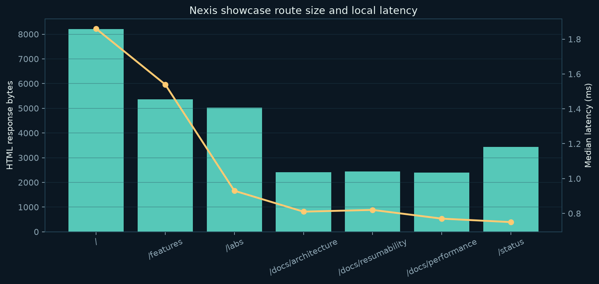
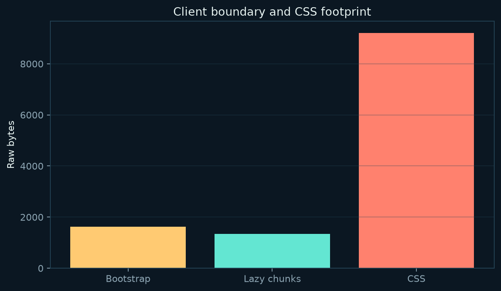
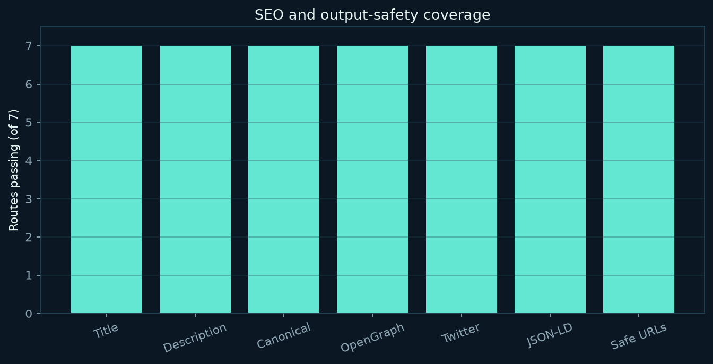

# Nexis Showcase — Phase 2 Production Parity Report

**Generated:** 25 August 2026
**Application:** `examples/nexis-showcase`
**Framework branch:** `feat/nexis-showcase-benchmarks`
**Author:** Manus AI

## Executive summary

Phase 2 converts the Nexis showcase from a feature specimen into a production-parity validation surface. The implementation adds a tagged ScopeRef ABI and lifecycle-aware client registry, routed action endpoints with JSON/form support and replay protection, an official route-aware Node production server and `nexis serve` command, bounded cancellation-aware stream output, adapter and renderer conformance tests, cached build-time WebP/AVIF variants, opt-in telemetry with a zero-byte disabled path, canonical derivation, schema-level JSON-LD checks, and generated sitemap and robots endpoints. The final production snapshot passes **20/20 benchmark gates**. The browser evaluator passes **19/19 checks**, the repository unit and integration suite passes **117/117 tests**, and the build, lint, formatting, high-severity dependency audit, and whitespace checks pass. Production-mode local measurements cover seven routes, true 404 and 405 behavior, action transport, crawler links, SEO endpoints, media variants, and a 1,621-byte raw resumability bootstrap. These are controlled local measurements, not internet production performance or SEO ranking evidence. The remaining gaps are primarily completeness and deployment depth: arbitrary closure serialization is still intentionally unsupported, action idempotency is process-local by default, stream rendering still materializes the complete tree before chunking, telemetry has no built-in ingestion or field Web Vitals pipeline, and edge adapters do not yet ship equivalent static-serving implementations.

## 1. Scope and deliverables

The showcase remains an executable application rather than a documentation-only example. It contains SSR pages, nested and dynamic routes, statically expanded documentation paths, resumable interaction boundaries, signal and store state, action transport, server utilities, runtime adapters, responsive media, CSS extraction, canonical and structured metadata, crawl endpoints, media build artifacts, and reproducible performance and SEO measurements.

| Phase 2 area     | Implementation                                                                                                     | Evidence                                                                                           |
| ---------------- | ------------------------------------------------------------------------------------------------------------------ | -------------------------------------------------------------------------------------------------- |
| Scope capture    | `ScopeRef` tagged union, stable IDs, client registry, signal/store/action resolution, unsupported-capture warnings | `packages/client/src/index.ts`, `packages/vite-plugin/src/index.ts`, client and plugin tests       |
| Routed actions   | JSON, URL-encoded, multipart parsing; validation; origin checks; typed envelopes; shared idempotency store         | `packages/actions/src/index.ts`, `packages/serve/src/index.ts`, `packages/dev-server/src/index.ts` |
| Official serving | `@mohammedaydan/serve`, `nexis serve`, safe route mapping, 404/405, HEAD, MIME and cache headers                   | `packages/serve/README.md`, `packages/serve/src/index.test.ts`                                     |
| Runtime parity   | Node, Cloudflare-style and Deno-style adapter checks; stream byte parity; cancellation and chunk bounds            | `tests/parity/runtime-parity.test.ts`, `packages/renderer/src/stream.test.ts`                      |
| Media            | Content-addressed build-time WebP/AVIF cache and showcase rewrite step                                             | `packages/media/src/index.ts`, `benchmarks/build-media.mjs`, `dist/client/media-manifest.json`     |
| Observability    | Explicit telemetry client, four-event schema, `sendBeacon`, zero-output disabled mode                              | `packages/telemetry/README.md`, `packages/telemetry/src/index.test.ts`                             |
| SEO              | Canonical derivation, schema-level JSON-LD checks, sitemap and robots artifacts/endpoints, crawler link scan       | `packages/seo/src/index.ts`, CLI build, benchmark collector/evaluator                              |

The Phase 2 architecture decision is recorded in [`docs/adr/phase-2-production-parity.md`](../../docs/adr/phase-2-production-parity.md) and indexed from [`docs/adr/README.md`](../../docs/adr/README.md).

## 2. Functional verification

The final repository verification was run on Linux with Node `v22.13.0` and pnpm `10.15.0`. The build traversed all workspace packages and both practical application fixtures. The full Vitest run covered 23 test files and 117 tests. The additional browser and benchmark checks were run separately against the showcase’s development and official production servers.

| Verification               |           Result | Notes                                                                    |
| -------------------------- | ---------------: | ------------------------------------------------------------------------ |
| Workspace build            |           Passed | All workspace packages and showcase build completed                      |
| Unit/integration tests     |      **117/117** | 23 Vitest files                                                          |
| Showcase browser evaluator |        **19/19** | SSR, ScopeRef interaction, action POST, routes, 404, console cleanliness |
| Repository E2E             | **13/13 passed** | CI-mode run; fixture and showcase servers both managed automatically     |

| Production benchmark gates | **20/20** | Official `@mohammedaydan/serve` on port 4173 |
| Lint | Passed | ESLint |
| Formatting | Passed | Prettier check |
| Dependency audit | Passed | `pnpm audit --audit-level=high`: no known vulnerabilities |
| Whitespace | Passed | `git diff --check` |

The browser action test exposed and corrected an important event-order issue: a form’s native submit navigation can occur before a lazy handler finishes importing. The bootstrap now prevents submit synchronously, then imports the handler and performs the action request. This is covered by the 19/19 browser artifact and the repository showcase E2E test.

## 3. Resumability and ScopeRef contract

The client package now supports tagged references for serializable values, live signals, stores, actions, and explicitly unsupported captures. The registry validates stable IDs, exposes `resolve`, `inspectScope`, `dispose`, and `disposeAll`, and releases registered signal/store resources. The Vite transform returns `scopeCaptures` and non-fatal `warnings` metadata. A `state(...)`, `computed(...)`, `createStore(...)`, or `action(...)` declaration is classified as a supported capability; arbitrary runtime objects and closures are reported as unsupported rather than silently serialized.

The showcase homepage emits `data-nx-scope` for a live signal reference. Its `onClick$` handler reads and updates the signal after the lazy chunk is imported. The browser check confirms visible mutation without a hydration root. The implementation is intentionally explicit: the current compiler does not infer and serialize arbitrary runtime values or reconstruct closures from source alone.

The raw production bootstrap is **1,621 bytes** and **930 bytes gzip**. The client budget remains below the existing 2,048-byte raw bootstrap gate and the 1,024-byte gzip CLI gate. The three generated chunks are 319, 312, and 711 bytes raw. Static routes continue to report zero route-specific JavaScript.

## 4. Action transport

Actions are available at `POST /__nexis/actions/<route>/<name>`. The transport accepts JSON, URL-encoded forms, and multipart forms, runs validation before authorization and handling, checks trusted origins, applies a shared idempotency store when an `Idempotency-Key` is supplied, and returns either `{ ok: true, data }` or `{ ok: false, errors }`. The development server and official production server use the same action pipeline. The labs route exports `submit`, and its browser form performs a real POST round-trip returning `Action result: queued:Ada`.

The transport is progressive-enhancement friendly because the form has a normal `action` and `method="post"`. The resumable enhancement adds JSON conversion and synchronous submit prevention only when the client boundary is activated. Unit coverage includes invalid input, rejected origins, duplicate keys, JSON, form data, method rejection, and success envelopes.

A production deployment must replace the default process-local idempotency store with a durable, bounded store shared by all instances. Origin policy must also be configured to the deployment’s actual site origins; the showcase’s demonstration action is not a substitute for an application-specific CSRF and authorization policy.

## 5. Official production server and runtime parity

`@mohammedaydan/serve` is now the supported route-aware Node server. It maps `/` and nested paths to generated `index.html` files, serves a built-in HTML 404 document or an application `404.html`, accepts `GET` and `HEAD`, rejects other methods with `405`, prevents traversal candidates, sets MIME types, and applies revalidation caching to HTML and immutable caching to assets. The CLI exposes this implementation through `nexis serve`; the showcase benchmark wrapper imports the package rather than carrying a bespoke server implementation.

The official server was exercised against the full built output. The final production benchmark confirms that all seven routes return 200, the unknown route returns a real HTML 404, `HEAD` and `405` behavior are covered by package tests, action transport works, and sitemap/robots files are served as dedicated endpoints.

Adapter parity coverage now compares Node, Cloudflare-style, and Deno-style handlers for status, headers, body output, server cache privacy, and portable conformance. Renderer streams are byte-identical to buffered output, use configurable bounded chunks, honor an abort signal, call a cancellation hook, and pause when the stream controller has no desired capacity.

The renderer stream still computes the complete rendered tree before slicing bytes into bounded output chunks. It therefore provides transport-level backpressure and cancellation behavior, but it is not yet a component-level incremental streaming renderer.

## 6. Media and observability

The media package now exposes `buildImageVariants`. It hashes source bytes and requested widths, caches the transform result in-process, writes WebP and AVIF outputs, and returns exact variant byte counts and cache-hit status. The showcase build generated four variants at widths 320 and 640: WebP and AVIF for each width. The output is recorded in `dist/client/media-manifest.json` and measured recursively by the benchmark collector. Native transform failure falls back to the original asset with a warning.

Telemetry is a separate opt-in package. Disabled telemetry returns an empty script and emits no beacon. Enabled telemetry sends only the documented low-cardinality events—navigation, route-transition error, chunk-load failure, and resumability activation—through `navigator.sendBeacon`. The package does not install observers or network requests merely because it is imported. The current implementation provides the client contract and event schema; it does not provide a server collector, consent UI, sampling backend, or built-in field LCP/CLS/INP observer pipeline.

## 7. Performance results

The final production snapshot was collected from the official route-aware server at `127.0.0.1:4173`, with five sequential requests per route. These values reflect the sandbox’s local filesystem, CPU, Node version, and process state. They exclude DNS, TLS, network transfer, CDN behavior, edge cold starts, browser parsing, font loading, image decoding, and real-user scheduling.

| Route                | HTML raw | HTML gzip | Median local latency | Status |
| -------------------- | -------: | --------: | -------------------: | -----: |
| `/`                  |  8,204 B |   2,791 B |              2.07 ms |    200 |
| `/features`          |  5,365 B |   1,994 B |              1.83 ms |    200 |
| `/labs`              |  5,028 B |   1,910 B |              0.96 ms |    200 |
| `/docs/architecture` |  2,411 B |     949 B |              0.90 ms |    200 |
| `/docs/resumability` |  2,437 B |     981 B |              0.84 ms |    200 |
| `/docs/performance`  |  2,403 B |     968 B |              0.79 ms |    200 |
| `/status`            |  3,439 B |   1,307 B |              0.82 ms |    200 |
| Unknown route        |    128 B |     116 B |              0.93 ms |    404 |

| Client artifact               | Raw bytes | Gzip bytes |
| ----------------------------- | --------: | ---------: |
| Resumability bootstrap        |   1,621 B |      930 B |
| Lazy chunk: largest           |     711 B |      417 B |
| All three lazy chunks         |   1,342 B |      852 B |
| Bootstrap plus chunks         |   2,963 B |    1,782 B |
| Extracted showcase stylesheet |   9,152 B |    2,952 B |

The development snapshot is retained separately in [`benchmark-results-dev.json`](benchmarks/benchmark-results-dev.json). Its median route timings ranged from **1.68 ms to 3.04 ms** across the same seven routes and it returned `Cache-Control: no-store`, as expected for the development server. The official production snapshot is [`benchmark-results-production.json`](benchmarks/benchmark-results-production.json).

## 8. SEO and crawler results

Technical SEO coverage passes on **7/7 measured routes** for title, description, canonical, OpenGraph URL, Twitter card, JSON-LD presence, schema-level JSON-LD shape, and dangerous-protocol scanning. Dynamic documentation routes now derive unique canonical paths from their resolved path instead of sharing one hard-coded canonical.

| SEO or crawl dimension                           |   Result |
| ------------------------------------------------ | -------: |
| Title                                            |      7/7 |
| Meta description                                 |      7/7 |
| Canonical                                        |      7/7 |
| OpenGraph title and URL                          |      7/7 |
| Twitter card                                     |      7/7 |
| JSON-LD presence                                 |      7/7 |
| JSON-LD context/type/name check                  |      7/7 |
| Dangerous URL protocol scan                      |      7/7 |
| `sitemap.xml` endpoint                           | HTTP 200 |
| `robots.txt` endpoint                            | HTTP 200 |
| Broken internal page links                       |        0 |
| Duplicate canonical/title/description signatures |        0 |

The build emits `sitemap.xml` and `robots.txt` from the expanded route manifest. The collector fetches both endpoints and crawls local page links. The SEO package’s schema check is deliberately conservative: it validates schema.org context, a supported type, and a non-empty name; it is not a complete external Schema.org validator.

No Search Console, analytics, backlink, keyword, country, ranking, indexation, or organic-traffic data was provided or inferred. This report therefore makes no claim about search visibility, rankings, traffic, backlink authority, or real-user Core Web Vitals.

## 9. Security evaluation

The final security evidence consists of existing security-isolation tests, targeted action transport tests, safe URL and CSS output checks, protocol scanning, request-size bounding for Node action requests, traversal rejection in the official server, origin validation, replay protection, safe cookie and header helpers, and a high-severity dependency audit with no known vulnerabilities reported by pnpm.

| Security control                                         | Evidence status                                           |
| -------------------------------------------------------- | --------------------------------------------------------- |
| Dangerous `javascript:`, `vbscript:`, and `data:` output | Measured: no findings in seven generated pages            |
| Server action validation before handling                 | Unit-tested                                               |
| Trusted-origin enforcement                               | Unit-tested and retained in action pipeline               |
| Idempotency replay rejection                             | Unit-tested; shared in-process server store               |
| Request body limit                                       | Implemented at 1 MiB in Node server adapter               |
| Static path traversal rejection                          | Unit-tested through official server behavior              |
| HTML escaping and JSON-LD script safety                  | Existing SEO/renderer tests pass                          |
| Dependency audit                                         | `pnpm audit --audit-level=high`: no known vulnerabilities |

The audit does not claim an authenticated penetration test or production security certification. Remaining deployment hardening includes durable idempotency, rate limiting, secret and error redaction policy, authenticated action authorization, CSRF policy review for every origin, distributed request limits, CSP nonce management, and monitoring of lockfile changes.

## 10. Reproducible benchmark artifacts

The benchmark commands and thresholds are documented in [`benchmarks/README.md`](benchmarks/README.md). The main artifacts are:

| Artifact                            | Purpose                                                 |
| ----------------------------------- | ------------------------------------------------------- |
| `benchmark-results-production.json` | Official production-server snapshot                     |
| `benchmark-results-dev.json`        | Development-server comparison snapshot                  |
| `benchmark-routes-production.csv`   | Route-level production CSV                              |
| `benchmark-routes-dev.csv`          | Route-level development CSV                             |
| `evaluation.json`                   | 20-gate production acceptance result                    |
| `browser-evaluation.json`           | 19-check Chromium result                                |
| `run-benchmarks.mjs`                | Route, asset, action, crawler, SEO, and media collector |
| `evaluate.mjs`                      | Threshold evaluator                                     |
| `browser-evaluate.mjs`              | Browser interaction evaluator                           |
| `build-media.mjs`                   | Reproducible build-time media step                      |
| `serve-production.mjs`              | Thin wrapper around the official serve package          |
| `assets/*.png`                      | Measurements rendered as report charts                  |
| `screenshots/` and `visual-qa.md`   | Desktop/mobile visual evidence                          |

The current production evaluator artifact records **20 passed checks out of 20**. The current browser evaluator records **19 passed checks out of 19**. The CI-mode repository Playwright run passed **13/13 tests**. These artifacts should be regenerated rather than hand-edited when source or environment changes.

## 11. Remaining framework gaps and priorities

The implementation closes the Phase 2 acceptance surface but does not imply that Nexis has reached feature-complete production maturity. The remaining gaps are ordered by user-visible risk and architectural leverage.

1. **Complete resumability serialization.** ScopeRef now provides a safe explicit ABI, but the compiler still does not serialize arbitrary closure values, reconstruct functions, or automatically inject every reference into `data-nx-scope`. The next step is a real capture pass with source-to-runtime manifests, explicit serializable-value boundaries, and lifecycle ownership tied to route transitions.

2. **Durable action execution.** The action transport is routed and secure by default for origin checks, but the default idempotency store is process-local. A production adapter needs durable replay storage, bounded retention, rate limiting, CSRF policy configuration, authenticated authorization hooks, and an endpoint observability contract.

3. **True incremental streaming.** Renderer output is now bounded and cancellation-aware, yet the full tree is still materialized before chunking. The next step is incremental component traversal, cancellation propagation into loaders, flush thresholds, and edge-runtime backpressure conformance under load.

4. **Edge-serving parity.** Node has the official route-aware server. Cloudflare and Deno adapters expose portable request handling but do not yet ship equivalent generated-static-file servers with the same cache, 404, action, and observability behavior.

5. **Production media integration.** Build-time WebP/AVIF generation and caching are available, but automatic `<picture>` generation, responsive format negotiation, persistent cache storage, remote-image policy, and universal route integration remain application-level work.

6. **Field observability.** The telemetry client and schema are opt-in and zero-byte by default, but Nexis does not provide ingestion, consent, sampling, privacy retention, cache-hit metrics, or real-user LCP/CLS/INP instrumentation out of the box.

7. **SEO validation breadth.** Sitemap, robots, canonical derivation, crawler links, and conservative JSON-LD validation are implemented. Full schema validation, hreflang, pagination, image/video sitemap support, redirect rules, and crawl-budget diagnostics remain future work.

8. **Routing completeness.** Layout composition, query-parameter schemas, method-specific route handlers, typed API routes, route-level cache invalidation watchers, and richer deployment adapter configuration remain outside the current contract.

## 12. Final assessment

Phase 2 is complete against its reproducible acceptance surface. The showcase is runnable, its interactive path no longer depends on a manually started server, its production wrapper is now an official framework package, its action and crawl endpoints are exercised over HTTP, its image variants and telemetry defaults are measurable, and the regression gates are represented by committed artifacts. The remaining items are documented as explicit engineering gaps rather than hidden behind a passing demo.

## References

[1]: benchmarks/benchmark-results-production.json 'Final official production benchmark snapshot'
[2]: benchmarks/benchmark-results-dev.json 'Final development benchmark snapshot'
[3]: benchmarks/evaluation.json 'Final 20-gate acceptance evaluation'
[4]: benchmarks/browser-evaluation.json 'Final 19-check browser evaluation'
[5]: ../../tests/e2e/showcase.spec.ts 'Repository showcase Playwright coverage'
[6]: ../../packages/seo/src/index.ts 'Nexis SEO helpers and schema validation'
[7]: ../../packages/serve/README.md 'Official route-aware production server'
[8]: ../../docs/adr/phase-2-production-parity.md 'Phase 2 production parity architecture decision'
